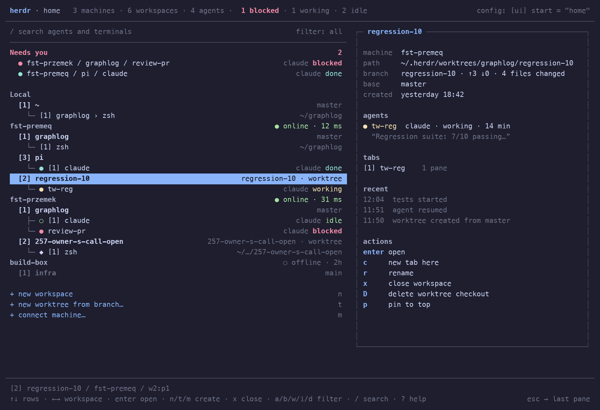

# paddock

Home screen for your [herdr](https://herdr.dev) fleet. A standalone terminal
client that shows every machine, space, terminal and agent on one screen and
drops you into any pane with Enter.



## What it does

- One tree: machines → spaces → panes, with agent kind and status on the right.
- **Needs you** on top: blocked and done agents from every machine.
- Detail panel below the tree: path, branch and dirty state, agents with their
  current topic, tabs, the last lines of the pane's screen.
- Live: subscribes to herdr's event stream on every machine, locally over the
  unix socket and remotely over one SSH connection, and refetches on change.
  Polling remains as a 20 s safety net.
- Pin spaces to the top of their machine. Pins persist in
  `~/.config/paddock/state.json`.
- Create spaces, worktrees and tabs. Rename, close, delete worktree checkouts.
- Connect a new machine (`herdr machine add`).
- Enter opens the pane inside paddock: the live terminal with a one-line status
  bar. `ctrl+b h` returns home, `ctrl+b ctrl+b` sends a literal ctrl+b. Esc on
  the home screen reopens the last pane.
- Mouse: click selects, click again opens, wheel scrolls. Inside a pane the
  mouse goes to the pane.

Data comes from the `herdr` CLI: `api snapshot` and `workspace list` locally
and through `herdr --machine <id>` for every enabled saved SSH machine. Events
come from `events.subscribe` on the herdr socket; on remote machines a tiny
Python bridge started over SSH forwards that socket, so the remote needs
`python3` and nothing else. Panes stream through `herdr terminal session
control`, locally or over SSH: herdr renders the pane to ANSI frames, paddock
replays them into its own cell grid and sends keys, paste, mouse and resizes
back.

## Install

Requires herdr 0.9 or newer on this machine and on every remote, with saved
machines configured through `herdr machine add`.

```bash
cargo install --path .
paddock
```

Options: `--local-poll SECS` (default 1), `--remote-poll SECS` (default 3).
These are the fallback intervals used while no event stream is connected.

### Zed

Run it in a center pane, next to file buffers: open the command palette and
run **workspace: new center terminal**, then type `paddock`. Bind it once in
`keymap.json` if you want a key:

```json
{ "context": "Workspace", "bindings": { "cmd-shift-h": "workspace::NewCenterTerminal" } }
```

## Keys

| Key | Action |
|---|---|
| `↑↓` `j k` | move |
| `←→` `h l` | previous / next space |
| `enter` | open the pane, or the space's active pane |
| `esc` | clear search and filter, else reopen last pane |
| `ctrl+b h` | inside a pane: back home (`ctrl+b q` and `ctrl+b esc` too) |
| `ctrl+b ctrl+b` | inside a pane: send a literal ctrl+b |
| `/` | search; words match independently |
| `a b w i d` | filter: all, blocked, working, idle, done |
| `n` `t` `m` | new space, new worktree from branch, connect machine |
| `c` `r` `p` `x` `D` | new tab, rename, pin, close, delete worktree checkout |
| `q` | quit |

## Limits

- Without `python3` on a remote machine paddock falls back to polling it.
- Remote machines need non-interactive SSH to the saved target.
- Opening a pane resizes it to paddock's viewport, like any herdr client would.
- herdr's own view does not follow paddock. Opening a pane focuses it on its
  server, which marks done agents as seen.

## Layout

```
src/main.rs      terminal lifecycle, event loop
src/app.rs       state, keys, prompts, actions, attached pane
src/pane_view.rs herdr terminal stream → cell grid → ratatui; key/mouse encoding
src/herdr.rs     herdr CLI runner (local or --machine), git state
src/events.rs    event subscription per machine, poll loop it wakes
src/model.rs     snapshot types, row builder, filters, pins
src/state.rs     persisted paddock state
src/ui.rs        rendering
src/theme.rs     palette
```

The ANSI grid parser is ported from [herdr-mirror](https://github.com/nikok6/herdr-mirror) (MIT).

Apache-2.0. Not affiliated with herdr.
