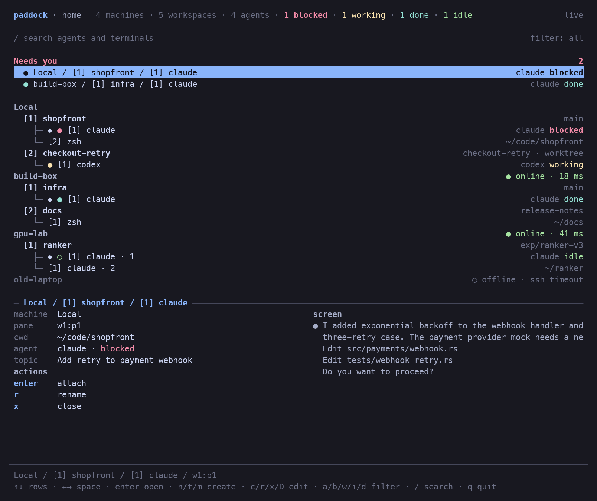

# paddock

Home screen for your [herdr](https://herdr.dev) fleet. Every machine, space,
agent and terminal on one screen; Enter drops you into any pane.



- **Needs you** on top: blocked and done agents from every machine.
- Tree of machines → spaces → panes with agent status, branch and path.
- Detail panel: git state, agents and their topic, tabs, the pane's last lines.
- Panes open inside paddock with a status bar. `ctrl+b h` brings you home.
- Create spaces, worktrees and tabs. Rename, pin, close, delete checkouts.
- Live: subscribes to herdr's event stream, locally and over SSH.

## Install

Needs herdr 0.9+ locally and on remotes, and Rust to build. Remote machines
are the ones you saved with `herdr machine add`.

```bash
cargo install --git https://github.com/premeq/paddock
paddock
```

Or as a herdr plugin, which opens paddock full screen inside herdr:

```bash
herdr plugin install premeq/paddock
herdr plugin action invoke premeq.paddock.open
```

Bind it in `~/.config/herdr/config.toml`:

```toml
[[keys.command]]
key = "prefix+g"
type = "plugin_action"
command = "premeq.paddock.open"
description = "paddock"
```

`paddock --demo` shows a fixture fleet without a herdr server.

## Keys

| Key | Action |
|---|---|
| `↑↓` `j k` · `←→` `h l` | move · previous / next space |
| `enter` | open the pane, or the space's active pane |
| `esc` | clear search and filter, else reopen last pane |
| `/` | search; words match independently |
| `a b w i d` | filter: all, blocked, working, idle, done |
| `n` `m` | new space, connect machine |
| `t` `c` `r` `p` `x` `D` | new worktree, new tab, rename, pin, close, delete checkout |
| `ctrl+b h` | in a pane: back home (`ctrl+b ctrl+b` sends a literal ctrl+b) |

The prefix is `ctrl+b` by default. Change it in `~/.config/paddock/state.json`:

```json
{ "prefix": "ctrl+a" }
```

Accepted forms: `ctrl`, `alt`, `shift` plus one character or `space`. If it
is also your herdr prefix, paddock sees it first inside a pane; send it
through with the double press.
| `q` | quit |

Mouse: click selects, click again opens, wheel scrolls.

## How it works

Everything goes through herdr's own CLI and socket API, locally and via
`herdr --machine`. State comes from `api snapshot`, changes from
`events.subscribe`; on remotes a small Python bridge over one SSH connection
forwards the socket, so remotes need only `python3`. Panes stream through
`herdr terminal session control`: herdr renders to ANSI, paddock replays it
into its own grid and sends keys, paste, mouse and resizes back. Pins and
settings live in `~/.config/paddock/state.json`.

Limits: opening a pane resizes it to paddock's viewport, like any herdr
client. herdr's own TUI does not follow paddock's selection.

## Zed

Command palette → **workspace: new center terminal**, then `paddock`.

## Credits

The ANSI grid parser is ported from
[herdr-mirror](https://github.com/nikok6/herdr-mirror) (MIT). Status glyphs
and palette follow herdr. Not affiliated with herdr.

MIT. See [CONTRIBUTING.md](CONTRIBUTING.md).
